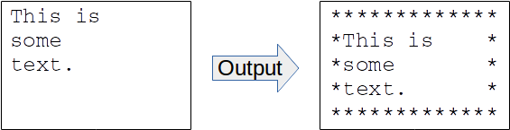
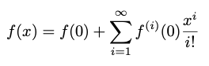
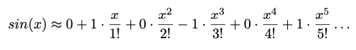
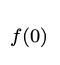

# CSC230 Project 1

This is your first, easy project.  The others will be larger and more
interesting.  This one will let you get started writing,
formatting, compiling, running and testing simple C programs. This
requires that you familiarize yourself with the [Common
Platform](https://www.csc2.ncsu.edu/courses/csc230/CommonPlatform.pdf)
and our [Coding Style
Guidelines](https://www.csc2.ncsu.edu/courses/csc230/coding_style.html).
A full list of the relevant [Learning Outcomes](#outcomes) is included
at the end of this page.

This project is to be done individually.  You should be able to solve
these problems using the material up to the end of the Lecture 2
slides.  Please don't go find other resources for implementing your
solution.  Solving these problems with material from just the first
two lectures should let you start on your code early, and it will give
you a chance to practice using basic C features for things like I/O.

## Getting Started

There is a starter file for this project,
[starter1.tgz](starter1.tgz). This file is a compressed tar archive
containing several files you'll need.  You'll need to unpack the files
inside to get started.  There are a couple of ways you can do this.

 * If you'd like, you can download the starter using a web browser on
   your local system, using the link above.  Then use an sftp client
   or a tool like ExpanDrive to copy the archive to a location in your
   AFS space where you want to work on this assignment.  For work on
   this project, I'd suggest making a directory for CSC 230 projects,
   then make a subdirectory under it for project 1.  Log in on a
   common platform machine, change directories to the path where you
   plan to work and then unpack the archive using a command
   like the following:  

```
$ tar xzvf starter1.tgz
```

 * Or, if you're already logged in on a common platform system, you
   can download the starter using curl instead of a web browser.  Make
   a directory where you'd like to work on the project, and **cd** to
   that directory.  Then, you can download and unpack the starter
   right in that directory.  The following commands should do the job:

```
$ curl -O https://www.csc2.ncsu.edu/courses/csc230/proj/p1/starter1.tgz
$ tar xzvf starter1.tgz
```
  
In general, when we grade your programs, we expect them to behave
exactly as described in the assignment.  This includes producing the
right output with the right spacing and line termination.  The project
1 starter includes some input files and expected output files to help
you make sure your programs are behaving correctly.  As described
below, you can capture your program's output in a file and then use
the `diff` command to compare the output you got with the output we
were expecting you to get.  If `diff` sees any differences, even in
spacing or line termination, it will tell you where they are.  There's
a little guide linked from the course home page explaining [how to use
diff](https://www.csc2.ncsu.edu/courses/csc230/guide/diff.pdf) and how to read its output.

# Part 0 : Registering with NCSU GitHub (a very easy 10 pts)

Using a web browser, visit [github.ncsu.edu](http://github.ncsu.edu)
and log in with your unity credentials.  If you're not able to log in
on this website, inform the instructor immediately (i.e., **before** the
deadline).

We'll be using NCSU's GitHub for submitting future projects. This
is an opt-in system, which means that the initial login is required so
that you are recognized as a user.  If you are not in the system, we
won't be able to create the repository that you will be using for
the rest of the course, and you won't be able to complete future
projects.

Maybe you've used git and github before.  That's great, but keep in
mind that you'll need to use your assigned repo, hosted on NC State's
GitHub for future projects.

## Grading

You'll get your 10 points just for logging in on the NCSU github.
This is a really easy 10 points to earn.  There is nothing to turn in
for this part of the assignment.  If you run into trouble logging in,
be sure to let us know before the deadline, so we can try to help you
out.

# Part 1 : Correcting Style (25 pts)

The program, [style.c](style.c) is an example of some bad style.  It
has everything, bad or missing comments, bad curly bracket placement,
some hard tabs for indentation, some incorrect line termination, no
line termination at the end of the last line, maybe more problems.
Edit this program to make it consistent with the [class style
guidelines](https://www.csc2.ncsu.edu/courses/csc230/coding_style.html).

The style guide requires particular types of block comments before
each function and at the top of each file.  After reformatting the
program, add these comments.  You may need to read the code for the
various functions so your comments can summarize what they each do.
You'll also find some opportunities to make sure the program uses
meaningfully-named constants instead of some magic numbers.

## Editing style.c

To edit the `style.c` source file, you can use a text editor or the
IDE of your choice.  Most of the style errors will be easy to see by
just looking at the source file and consulting the class style guide
document.  Some style errors are in the whitespace of the source file
(spaces or line termination).  These may be more difficult to see in
your editor.  To check these, you may want to use the `hexdump`
program.  If you run it like the following, it will show the sequence
of characters in the source file, in hexadecimal on the left and as
symbols on the right.  This will let you see exactly what caracters
are in your source file by looking at the sequence of hexadecimal
codes on the left.

```bash
$ hexdump -C style.c
00000000  23 69 6e 63 6c 75 64 65  20 3c 73 74 64 69 6f 2e  |#include <stdio.|
00000010  68 3e 0a 23 69 6e 63 6c  75 64 65 20 3c 73 74 64  |h>.#include <std|
00000020  6c 69 62 2e 68 3e 0a 0a  23 64 65 66 69 6e 65 20  |lib.h>..#define |
00000030  53 45 56 45 4e 54 59 20  37 32 0a 0a 76 6f 69 64  |SEVENTY 72..void|
00000040  20 70 72 69 6e 74 57 6f  72 64 28 20 69 6e 74 20  | printWord( int |
00000050  78 20 29 0a 7b 0a 20 20  20 20 66 6f 72 20 28 20  |x ).{.    for ( |
00000060  69 6e 74 20 69 20 3d 20  30 3b 20 69 20 3c 20 78  |int i = 0; i < x|
00000070  3b 20 69 2b 2b 20 29 0a  20 20 20 20 7b 0a 20 20  |; i++ ).    {.  |
00000080  20 20 20 20 20 20 20 20  20 20 2f 2f 20 50 72 69  |          // Pri|
00000090  6e 74 20 61 20 72 61 6e  64 6f 6d 20 6c 6f 77 65  |nt a random lowe|
000000a0  72 2d 63 61 73 65 20 6c  65 74 74 65 72 2e 0a 20  |r-case letter.. |
000000b0  20 20 20 20 20 20 20 20  20 20 20 70 72 69 6e 74  |           print|
000000c0  66 28 20 22 25 63 22 2c  20 39 37 20 2b 20 72 61  |f( "%c", 97 + ra|
000000d0  6e 64 28 29 20 25 20 32  36 20 29 3b 0a 20 20 20  |nd() % 26 );.   |
000000e0  20 7d 0a 7d 0a 0a 69 6e  74 20 70 72 69 6e 74 4c  | }.}..int printL|
000000f0  69 6e 65 28 29 20 7b 0a  09 69 6e 74 20 63 6f 75  |ine() {..int cou|
00000100  6e 74 20 3d 20 30 2c 20  70 6f 73 20 3d 20 30 2c  |nt = 0, pos = 0,|
00000110  20 73 70 61 63 65 20 3d  20 30 3b 0a 09 69 6e 74  | space = 0;..int|
... more hexdump output omitted ...
```

The example above shows the start of the hexdump output for the
`style.c` file from the starter, before any corrections have been
made.  Down near the bottom, you can see a problem with the file, the
characters with a hexadecimal code of 09.  These are hard tab
characters used for indentation in a few places.  The style guide says
we shouldn't use hard tabs for indentation, so you'll want to replace
these with an appropriate number of spaces using your text editor.

There are also some places in the `style.c` file where Windows-style
line termination is used at the end of a line.  These will show up as
a two-character sequence, 0d 0a, in the hexdump output.  You'll want to
replace these with with Unix-style line termination, just a newline
character, 0a.  If you have trouble making this correction in your
editor, you may want to try the `dos2unix` command installed on the
common platform systems.  It can change the type of line termination
used everywhere in a text file.

## Program execution

When your `style.c` program runs (even before you correct the style),
it should exit with a successful exit status and produce the following
output.  The starter also includes a expected-style.txt file you can
use to make sure your style-corrected program produces exactly the
output we're expecting (a randomly-generated paragraph of text).

```
wlrb mqbhcd r owkk hiddqsc xrjm wfr sjyb dbef arcbynecd ggx pklore
nmpa qfwkho kmcoqhnw kuewhsqmgb uqcljj vsw dkqtbxi mvtrrbljpt snfwzqfj
fadrrwsof b nuvqhff saqxwpqcac hchzv rkmlno jkpqpx jxkitzyx cbhhkic
oendtomfg wdwf gpxiq kuytdlcgde htaciohor tq vwcsgspqo msb agu nny
nz gd wpbtr blnsade guumoqc rubetoky hoachwdvmx rdryxl n qtukwa mleju
wci xubume meya drmydiajxl ghiqfmz lvihjo vsuyoyp yul eim otehzri c
kpggkbb p zrzu xamludf kgruowz i oobpple lwphapjna qhdcnvwdtx bmyppp
uxnspusgd iixqmbfjxj v djsuyib ebmws q oygyxym evypzvje ebeocfu
sxdixtigsi ehkch dflilrjq nxzt rsvbspkyh enbppkqtp dbuotbbqcw vrf ju jd
tg iqvdg ijvwcya bwewpjvyg hljxepb iwuqzdzu du zv fspqp wuz f ovydd
Words: 103
```

This program's output depends on the random number generator.  If you
run it on a system that's not a common platform machine, you may get a
different sequence of random numbers, so your output may not match the
expected output.  Be sure to check it on a real common platform system
to make sure you're getting the output we expect.  Your style
corrections shouldn't change the program behavior, but checking the
output is a good way to make sure you didn't modify the program's
behavior accidentally.

## style.c Grading

For this part of the assignment, you'll be submitting your modified
source file, `style.c`, to the Project 1
assignment in Moodle.
Your submission will be graded according to the following:

  * Adding the required block comments: **10 points**
  * Correcting source code formatting and other style problems: **10 points**
  * Program still compiles cleanly and produces the right output: **5 points**

# Part 2 : Text Box (25 pts) 

Have a look at the [textbox.c](textbox.c) source file.  This program
is intended to give you a chance to try reading input
character-by-character using getchar() and printing characters using
putchar().  The overall skeleton of this program is done for you, but
you'll need to fill in the bodies of the functions to get it working.

The job of this program is to print text from standard input, but with
a border around the text.  The figure below shows how it's supposed to
work.



The border drawn around the text is a fixed-width, and made from a chosen
character.  It should be tall enough to contain every line read from
standard input.  Both the box width and the character it's made of are
specified via preprocessor constants, so it would be easy to change
them and then re-compile the program.  We'll use a border that's made of
asterisks and contains lines of 60 characters (so, a lot wider than
the figure above shows).  This width value is the length of each line of
text *inside* the border.  With a border character at the start and end
of each output line, these will actually be two characters longer.
So, by default, output lines will all be 62 characters, with 60
characters in between he first and last character of the border.

Input lines may not all be exactly the right length; probably, many of
them will be shorter than 60 characters or longer.  We don't know how
to work with strings yet, so we'll have to work
character-by-character.  As you're reading the input and printing the
output, you'll need to count the characters on the current line.  For
lines that are shorter than 60 characters, you'll need to print some
extra spaces at the end, to get the output length up to 60 characters.
For input lines that are too long, you'll need to read and print the
first 60 characters.  After that, you'll still need to read the rest
of the characters up to the end of the line, but you won't want to
print more than the first 60 characters to the output.

## Design and Implementation

Your program will define and use the following three functions.
You can have more if you want, but we'll be looking for at least these three.

  * `void lineOfChars( char ch, int count )`  
     This function prints out multiple copies of the given character,
     followed by a newline.  The number of copies is determined by the
     count parameter.  Use this function to help print the top and
     bottom border around the text.
     
  * `bool paddedLine()`  
     This function will read and print *a single line of text* inside
     the border.  Your main function will call this over and over,
     once for each line of input.  The function returns true or false
     to tell the caller if there was another input line to process.
     If it successfully reads (and prints) an input line, it should
     return true.  Otherwise (i.e., it hits EOF before it can read any
     characters), it should return false to tell the caller that
     there's no more text to put in the box.  This function will read
     the text from standard input and print to standard output.  If
     the line of text isn't long enough, it will add extra spaces at
     the end to make the box rectangular.  If a line of text is too
     long, it will read and discard extra characters on the line
     (i.e., up to the end-of-line) to keep the box rectangular.
     
     We don't know how to store strings yet, so this function will
     need to work by reading in and handling just one character at a
     time.  You can do this by keeping up with how many characters
     you've read in for the current line and deciding what to do with
     each character as you read it.  Remember, each time the
     paddedLine() function is called, it should read in a whole line
     of characters, but it may not be able to print all those
     characters and it may have to print some extra characters.  If
     the line is shorter than the width of the box, it will need to
     print some extra characters at the end.  If the line is longer
     than the width of the box, the function will still need to read
     the whole line; it just won't print any of the characters out
     past the end of the box.
     
     This function is probably the most fun/tricky part of this
     assignment.  The test cases provided with the starter will help
     you try out your function's behavior and make sure it's doing the
     right thing in all situations.  When printing out a line in the
     middle part of the text box, you can either make main()
     responsible for printing the border characters at the start and
     the end, or you can make this function handle it, whichever seems
     easier to you.

  * `int main()`  
     This is, of course, the starting point of your program.  It will
     use the other two functions to print the text from standard input
     with a border around it.
     
Be sure to fill in the empty block comments in this program according
to the style guide.  Remember, a file comment has a short summary of
the file/program, along with a file and an author tag.  A block
comment on a function needs a short summary of what the function does,
along with param tags for any parameters the function takes, and
return tag if it's not a void function.

## Testing

Compile your program using the following command.

```bash
$ gcc -Wall -std=c99 textbox.c -o textbox
```

You can run the program and type input to it yourself, but the
output will look a lot better if you use redirection to read input
from a file.  If you just want to see what your program's output looks like,
you can run it like:

```
$ ./textbox < input-text-1.txt
```

If you really want to make sure your output is right, you can capture
the output in file and compare it against one of our expected output
examples.  The `>|` syntax below tells the shell to send the program's
output to a file rather than letting it go to the terminal window.
Even if the output file already exists, this syntax tells the shell to
overwrite it.  Try running your program as follows to tell it to read
input from our first test case (input-text-1.txt) and send output to a
file named `output.txt`.  Then, check your programs exit status to make
sure it reported successful execution, and use diff to help make sure
it produced output that matches what we were expecting.


```
$ ./textbox < input-text-1.txt >| output.txt
$ echo $?
0
$ diff output.txt expected-text-1.txt
```

You can use similar commands to test your program against each of the
four test cases we're providing.  Here's what they each do:

  1. This test input contains five lines, each one 60 characters long,
     exactly long enough to fill a line of the box.  It should be
     easy.
     
  2. This test has lines that are all shorter than the box width, so
     they'll all have to be padded with extra spaces at the end to make
     the box the right width.
     
  3. This test has some lines that are too long, so the extra
     characters at the end will have to be discarded as the line is
     processed.
     
  4. This test contains a few lines of text, some that have to be
     padded with spaces and some (one) that has to be truncated.

Remember, you need check the exit status right after you run your
program.  If you get an exit status of zero and diff doesn't report
any differences between the expected output and the actual output you
got, then it looks like your program is behaving correctly.  If diff
notices any differences, it will report the line number where there's
a discrepancy, along with the contents of the lines that don't match.
If you have trouble interpreting the output of diff, you can try out
the `sdiff` command. This works like diff, but it will display the
expected and actual output files side by side, and may make it easier
to see inconsistencies between the files. To use sdiff, just replace
`diff` with `sdiff` in the shell code above.

## textbox.c Grading

For this part of the assignment, you'll be submitting your modified
source file, `textbox.c` to the Project 1
assignment in Moodle.
Your edits to `textbox.c` will be graded according to the following:

  * Compiling cleanly: **5 points**
  * Producing the right output during execution: **15 points**
  * Following the style guidelines: **5 points**  
    This includes commenting, consistent indentation (you can change the
    indentation from the starter code, if you want), curly bracket
    placement, etc.
  * Not following the design: **Up to 20 percent deduction**  
    This includes implementing and using the functions described above
    and using the preprocessor constants defined in the starter.
  * Late submission **20 percent deduction**

# Part 3 : Trigonometric Function Calculation

C has a math library, containing functions for things like square
roots, logarithms and trigonometry.  We'll learn about this library
soon.  For this part of the project, we'll try out a way to compute
the trigonometric functions yourself, without using the math library.

Our program will be called `trig.c`.  When run, it will read an angle,
*x*, from the user as a double value.  Then, it will print out a table
of successively more accurate approximations of the sine of *x*, the
cosine of *x* and the tangent of *x*.  The following shows a sample
execution of our program.  The first line shows the user running the
program at the shell prompt.  Then, the user enters 1.75 as the input
angle.  Then, the program prints out a table giving better and better
approximations.  It stops when the result seems accurate enough.  For
this example, it takes 14 iterations.

<pre>
$ <b>./trig</b>
<b>1.75</b>
terms |         sin |         cos |         tan 
------+-------------+-------------+-------------
    1 |   0.0000000 |   1.0000000 |   0.0000000
    2 |   1.7500000 |   1.0000000 |   1.7500000
    3 |   1.7500000 |  -0.5312500 |  -3.2941176
    4 |   0.8567708 |  -0.5312500 |  -1.6127451
    5 |   0.8567708 |  -0.1404622 |  -6.0996524
    6 |   0.9935465 |  -0.1404622 |  -7.0734067
    7 |   0.9935465 |  -0.1803552 |  -5.5088336
    8 |   0.9835733 |  -0.1803552 |  -5.4535359
    9 |   0.9835733 |  -0.1781735 |  -5.5203117
   10 |   0.9839975 |  -0.1781735 |  -5.5226925
   11 |   0.9839975 |  -0.1782477 |  -5.5203924
   12 |   0.9839857 |  -0.1782477 |  -5.5203262
   13 |   0.9839857 |  -0.1782460 |  -5.5203795
   14 |   0.9839860 |  -0.1782460 |  -5.5203808
</pre>

## User Input

Our program expects the user to enter an angle in radians as input.
It doesn't print out a prompt; the user is just expected to know what
to do after they run the program.  If the user enters a value that
can't be parsed as a double, or if they enter something larger than
<var>&pi;</var> or smaller than <var>-&pi;</var>, the program will print a line with the
following error message (printed to the terminal, standard output) and
then exit with an exit status of 1.

```
Invalid input
```

## Approximating Sine and Cosine

Our program will use the Taylor series to compute our approximation of
sine and cosine.  You probably remember the Taylor series from
calculus class.  It lets us compute the value of a function at any
point, *x*, as long as we know the value of the function at a nearby
point *a* and we know first, second, third, ... derivatives of the
function at *a*.  There's a
[wikipedia page](https://en.wikipedia.org/wiki/Taylor_series)
if you'd like a more detailed reminder.

The following shows the Taylor series for a point, *x*, based on the
value and derivatives of f() at some nearby point, *a*.  The first
term of the series is just the value of f() at *a*.  The next term is
the derivative of f() at *a* times (x - a) divided by one factorial.
Successive terms are similar.  They use successive derivatives of f()
(i.e., the second derivative, the third derivative and so on), they
use successive powers of (x - a) and they use successive factorials in
the denominator.


We can simplify the Taylor series a little bit if we use zero for
*a*.  The following shows the series after this simplification.  This
is how we'll use the Taylor series for this program.


If we use the notation f<sup>(i)</sup>( 0 ) to represent
the ith derivative of f(), then we can write the Taylor series using
summation.  To compute an approximation, we'll just use the first few
terms in this infinite series.



This series works out very nicely when we're using it to compute sine
and cosine.  The table below shows the value of sin(a) at a = 0 and
its successive derivatives.  The value of sin( 0 ) is zero.  You may remember that the
first derivative of sin() is the cosine function, so the first
derivative of sin(a) at a = 0 is 1 (that's the value of cos( 0 ) ).  The
second derivative of sin() is -sin(), so the value of the second
derivative of sin(a) at a = 0 is 0.  The third derivative of sin() is
-cos(), so the value of the third derivative of sin(a) at a = 0 is -1.
The fourth derivative of sin() is just sin(), so the derivatives of
sin() form a cycle that goes like: sin() &rarr; cos() &rarr; -sin() &rarr; -cos()
&rarr; sin()

<table border=1>
<tr> <th>derivative of f() </th> <th> for f(a) = sin(a) </th>
<th>value at a = 0 </th> </tr>

<tr> <td>f(a)</td> <td> sin(a) </td>
<td> 0 </td> </tr>

<tr> <td>f<sup>(1)</sup>(a)</td> <td> cos(a) </td>
<td> 1 </td> </tr>

<tr> <td>f<sup>(2)</sup>(a)</td> <td> -sin(a) </td>
<td> 0 </td> </tr>

<tr> <td>f<sup>(3)</sup>(a)</td> <td> -cos(a) </td>
<td> -1 </td> </tr>

<tr> <td>f<sup>(4)</sup>(a)</td> <td> sin(a) </td>
<td> 0 </td> </tr>

<tr> <td>f<sup>(5)</sup>(a)</td> <td> cos(a) </td>
<td> 1 </td> </tr>

</table>

If we fill in these values to get the taylor series for sin(), we get
the following.  You can see that half the terms have a coefficient of
zero.  They don't affect the result, but we'll still count them when
we're reporting the number of terms used to get the current
approximation (see below).



To compute the Taylor series for cosine, you can think about the value
of cosine at zero and what the derivatives of cos() evaluate to.
You'll come up with a series that's similar to the one above, but with
zero, one and negative one coefficients on different terms.

## Approximating Tangent

The value of tan( x ) should be equal to sin( x ) / cos( x ).  So,
whenever we update the approximation for sine or cosine, we can compute a
new, more accurate approximation for tangent.

## Table Output

As shown above, the program's output table has four columns, with a
header at the top.  Columns are separated by a vertical bar, with a
space on either side of every bar.  The first column is an integer,
printed in a 5-column field.  The rest of the values are all real
numbers, printed in an 11-character field and rounded to 7 fractional
digits.  Each row of the table gives an approximation of the sine,
cosine and tangent for the input angle based on the Taylor series.

The first column reports the number of terms used in the Taylor series
approximation.  Each line of the table uses an additional term, to give
us successively more accurate approximations.  For terms, we'll count
every term in the taylor series, even the ones with coefficients of
zero.  So, for example, a Taylor series with just one term would look like:



A series with four terms would look like:


## Accuracy Threshold

The `trig.c` program should print out lines of the table until it gets
values for sine and cosine that appear to be accurate enough.  It will
check this by comparing the new values for sine and cosine with the
previous values.  If each of these differ by no more than
0.000001 (that's <var>10<sup>-6</sup></var>) from their previous
values, then the program can stop after the current row.

In the example output above, the last two values of sine differ by
about 0.0000003 (that's 3 * <var>10<sup>-7</sup></var>) and the last
two estimates for cosine differ by zero, so the program stopped after
14 rows.
   
## Design and Implementation

The starter contains a partial implementation for the [trig.c](trig.c) 
program.  You get to fill in the functions and create meaningful named
constants to make the program easy to understand and
modify.  You'll define and use the following five functions.  You can
have more if you want.

  * `double getAngle()`  
    This function reads the angle input from the user and returns it.  It should
    check to make sure the user enters a valid real number for the
    input and that the value is in the right range.  If not, it
    should print the "Invalid input" error message and exit the
    program unsuccessfully.
     
  * `double difference( double a, double b )`  
    This function returns the positive difference between a and b.
    It is used to tell when the current estimate of sine and cosine
    is accurate enough.

  * `void tableHeader()`  
    Print the two header lines at the top of the table.
  
  * `void tableRow( int terms, double s, double c, double t )`  
    Print a row of the table, reporting the number of terms used for
    the Taylor series approximation (terms), the current value of sine
    (s), cosine (c) and tangent (t).

  * `int main()`  
    This is the starting point for running your program.  It will use
    the other four functions to read user input and to help write out
    the output table.

Be sure to fill in the block comments for the source file and the
bodies of the functions you get to write.  For preprocessor constants
you define, be sure to give a short Javadoc-style comment that says
what they're for.

## Testing

You should be able to compile your program using the following gcc
command:

```bash
$ gcc -Wall -std=c99 trig.c -o trig
```

This program is easy to run with input entered by the user.  While
you're developing and debugging, you may just want to type in an input
value yourself and watch how the program behaves.  Once you think it's
running correctly, you can start comparing the output against expected
output for our provided test cases.  You can use commands like the
following.  Here, we're running the program on test input 1 for the
trig program and sending its output to a file named `output.txt`.
Immediately after it finishes, we check the exit status.  For test
input 1, it should exit successfully, and it does here.  Then, we
compare the output with the expected output to make sure there are no
differences.

```
$ ./trig < input-trig-1.txt >| output.txt
$ echo $?
0
$ diff output.txt expected-trig-1.txt
```

For the trig program, a couple of the tests are invalid inputs.  For
these, the program isn't expected to exit successfully, and it should
print an error message.  Below, we're showing how to test against one
of these invalid test cases.  First, we run the program with test
input 4 and send its output to a file named `output.txt`.  After that,
we check the exit status.  For this test, it should exit with a status
of 1, and it does. Then, we check if the program's output (an error
message) matches the expected output.

```
$ ./trig < input-trig-4.txt >| output.txt
$ echo $?
1
$ diff output.txt expected-trig-4.txt
```

We're providing five test cases to try your program with, each with an
input file and an expected output file.  They
provide different values for the input angle, including two with
invalid user input.

 1. This test uses an input angle of 1.0

 2. This test uses an input angle of 3.1415.  This is a valid angle,
 but it will require more terms to converge to an estimate that's
 accurate enough.

 3. This test uses an input angle of -0.5.  This test should converge
 more quickly.

 4. This test gives an invalid input.  It's a legal real number but
 it's out of range for the program.

 5. This test gives an invalid input.  It's not even a valid real
 number input.

## trig.c Grading

For this part of the assignment, you'll be submitting your modified
source file, `trig.c` to the Project 1 assignment in Moodle.
We'll grade it using the same criteria as the `textbox.c` program:

  * Compiling cleanly: **5 points**
  * Producing the right output and exit status during execution: **15 points**
  * Following the style guidelines: **5 points**  
    commenting, consistent indentation, curly bracket
    placement, magic numbers, etc.
  * Following the design **Up to 20 percent deduction**  
    Implementing and using the expected functions, no global variables.
  * Late submission **20 percent deduction**

# Notes on Completing the Assignment

Of course, before you submit, you'll want to be sure both of your
programs are consistent with the CSC 230
[Style Guidelines](https://www.csc2.ncsu.edu/courses/csc230/coding_style.html).
Also, make sure they compile cleanly (no errors or warnings) on a
common platform machine using the required compiler options.

There is a 24 hour window for late submissions. You'll be permitted to
submit your assignment up to 24 hours past the due date, but it will
cost you a *20 percent* deduction if you submit your assignment late.

# Common Problems

  * While developing, if a program enters an infinite loop,
    use `Ctrl+C` to stop it.

  * Make sure you submit source files (ending in .c), not your
    executable programs.
  
  * Make sure you've submitted all of your files in the Moodle
    assignment for Project 1.  After submitting, you can go back and
    check to make sure your files are all there.

  * Contact the teaching staff if you run into a problem submitting
    your work.  Or, visit Piazza and see if someone else has run into
    the same kind of problem.

<a name="outcomes"></a>

# Learning Outcomes

The syllabus lists a number of learning outcomes for this course.
This assignment is intended to support several of theses:

 * Write small to medium C programs having several
   separately-compiled modules
    
 * Explain what happens to a program during preprocessing,  lexical
   analysis, parsing, code generation, code optimization, linking, and
   execution, and identify errors that occur during each phase.
   In  particular, they will be able to describe the differences in
   this process between  C and Java.

 * Correctly identify error messages and warnings from the
   preprocessor, compiler, and linker, and avoid them.
    
 * Find and eliminate runtime errors using a combination of  logic,
   language understanding, trace printout, and gdb or a similar
   command-line  debugger.

 * Interpret and explain data types, conversions between data types,
   and the possibility of overflow and underflow
    
 * Explain, *inspect*, and
   implement *programs using structures  such as enumerated
   types, unions, and constants and arithmetic, logical,  relational,
   assignment, and bitwise operators.*

 * Trace and reason about variables and their scope in a  single
  function, across multiple functions, and across multiple
  modules.

 * Write, debug, and modify programs using library utilities,
   including, but not limited to assert, the math library, the string
   library, random number generation, variable number of parameters,
   standard I/O, and file I/O

 * Use simple command-line  tools to design, document,
   debug, and maintain their programs.
    
 * Distinguish key elements of the syntax (what's
   legal), semantics (what  does it do), and pragmatics (how is it
   used) of a programming language.

